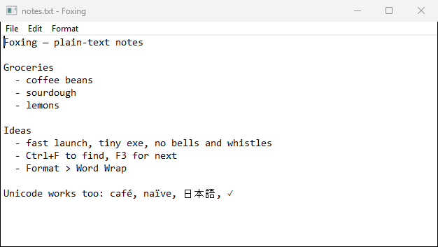
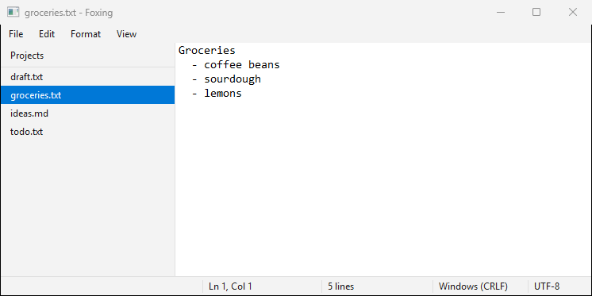

# Foxing

A tiny plain-text editor for Windows, written in Rust. Just text files.





Foxing is the brown spotting that shows up on old paper. This is the
paper.

## Why

- **Small.** About 256 KB, a single exe with no runtime to install.
- **Fast.** Raw Win32 and its own text engine. No framework, no GPU startup.
- **Big files.** Opens, edits, searches, and saves text files up to 2 GB.
  A 2 GB file opens in about 1.5 s and typing stays instant, word wrap
  included.
- **Plain.** Opens UTF-8, UTF-16, and legacy Windows-1252 files. Saves
  UTF-8 and keeps the file's line endings (CRLF or LF) as they were.

## Features

- New, Open, Save, Save As
- Undo (`Ctrl+Z`) and redo (`Ctrl+Y`)
- Find (`Ctrl+F`) and Find Next (`F3`)
- Word wrap (Format menu)
- Status bar with line/column, line count, line ending, and encoding
- Light and dark themes, following the Windows setting by default (View menu)
- Open from the command line (`foxing todo.txt`) or by dragging a file
  onto the window
- Open a folder (File → Open Folder, or `foxing <folder>`) to get a sidebar of
  its `.txt` and `.md` files; the last folder comes back next time
- Unsaved-changes prompt on close

## Install

Download from [Releases](https://github.com/1kevgriff/Foxing/releases):

- `foxing-<version>-x64.msi` installs for the current user (no admin
  prompt), adds a Start Menu shortcut, and adds Foxing to "Open with" for
  `.txt` files.
- `foxing.exe` runs as-is from anywhere.

The builds are unsigned, so Windows SmartScreen may warn on first run.

## Build

Requires Rust (version pinned in `rust-toolchain.toml`) and the MSVC
build tools.

```powershell
cargo build --release          # target/release/foxing.exe
./scripts/verify.ps1           # fmt, clippy, size and DLL gates, all tests
./scripts/build-msi.ps1        # MSI via WiX (needs the .NET SDK)
```

The end-to-end tests launch the real exe and drive it with window
messages, so run them on a desktop session.

## Release

Bump `version` in `Cargo.toml`, commit, then push a matching tag:

```powershell
git tag v0.1.0
git push origin v0.1.0
```

The release workflow verifies the build, tests the MSI, and publishes a
GitHub release with the exe, a zip, the MSI, and SHA-256 checksums.
